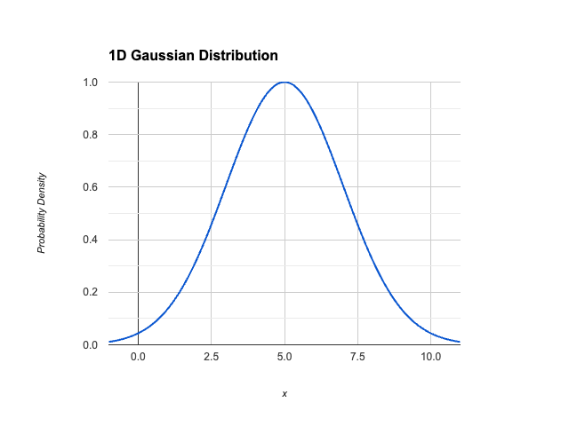
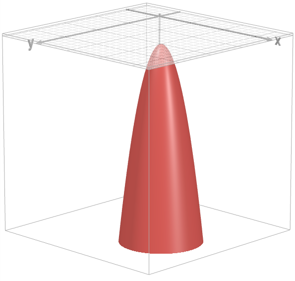
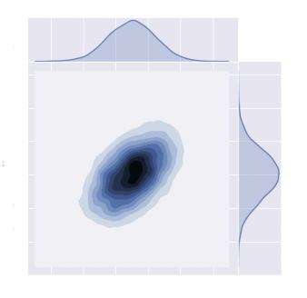

Unsupervised ML Models are used to cluster similar data points together and assign labels to them. This task is simply termed as Clustering.

# What is Clustering?
Consider the following toy data from an online market place,

| serial_number |   id   | n_clicks | n_visits | amount_spent | amount_discount | days_since_registration |
| :-----------: | :----: | :------: | :------: | :----------: | :-------------: | :---------------------: |
| 0 | 1476 | 130 | 65 | 213.905831 | 31.600751 |  |
| 1 | 1535 | 543 | 46 | 639.223004 | 5.689175 |  |
| 2 | 1807 | 520 | 102 | 1157.402763 | 844.321606 |  |
| 3 | 1727 | 702 | 83 | 1195.90363 | 850.041757 |  |
| 4 | 1324 | 221 | 84 | 180.754616 | 64.283300 |  |

How can this data be used such that it benefits the market place?
- The market place can use this to find different clusters of customers (i.e., Customer Segmentation).

Clustering is grouping similar items together. If the market place data is plotted, then it is likely that many inherent patterns can be visualized. The inherent patterns can be grouped together to form clusters. Thereafter, a strategy can be deployed to deal with each of the clusters, or one strategy can be deployed to deal with all the clusters.

Data points that are close and are a part of the cluster, usually have something in common. The ideal case in Clustering is such that, different clusters are clearly separated.

Therefore,
1. Points within a cluster are similar to each other.
2. Points in different clusters should be clearly separated.

The grouping of data points into clusters is based on similarity, and distance is used as the metric to define similarity. The different distance metrics are, Manhattan, Euclidean, Hamming, Minkowski, etc.

### Definition of Similarity
Closeness of data points defines similarity. But closeness should also make sense. For example, in the online market place data, the customers who spend the same amount of money can be considered similar.

Plot `n_clicks` vs `amount_spent`. The people who fall in a cluster where the `n_clicks` and `amount_spent` is high, make a good cluster. Meaning, they are good spenders and are active on the platform. Hence, a business strategy can be drawn to deal with customers in each cluster. Also, further micro-analysis can be conducted once the clusters are formed.

### How to ensure if a cluster is good or bad?
Since there are no labels, business sense plays a crucial role in determining the goodness of clusters.

Once the clusters are formed, the customers can be filtered and their mean purchase value can be found. Further analytical techniques can be applied to each one of the clusters differently. Although, there are techniques to understand the goodness of a cluster, they offer no certainty on the goodness.

### Terminology
- Intercluster distance: Distance between two different clusters.
- Intracluster distance: Distance between the data points within a single cluster.

In order to clearly separate the clusters, intercluster distance should be maximized and intracluster distance should be minimized.

There can be many different distances that can be measured, for example,
1. Distance between the furthest points of the both clusters.
2. Distance between the nearest points of the both clusters.
3. Distance between the centroid of the both clusters.

The different distance metrics that can be chosen from are,
1. Manhattan.
2. Euclidean.
3. Cosine.

The distance metric chosen is entirely dependent on the type of, or nature of the business. In practice, if the number of dimensions are low, Euclidean Distance is preferred. Manhattan Distance is preferred if the number of dimensions are low to medium. Cosine Distance is preferred if the number of dimensions are high.

The definition of low, medium and high is dependent upon the size of the dataset, or business case. The best practice is to find the results with each of the distances, and then check how better the results are with each distance metric.

### Evaluation of Goodness of Clusters
- For intercluster distance:
    - The true representation of the distance is defined by the minimum of all the intercluster distances found by comparing all the intercluster distances.
    - Meaning, if the minimum value of all the distances is big enough, then the separation is said to be good.
- For intracluster distances:
    - The true representation of the distance is defined by the maximum of all the intracluster distances within a cluster, found by comparing all the intracluster distances.
    - Meaning, if the maximum value of all the distances is small enough, then the grouping is said to be close or in other words, cluster is said to be tight.

### Dunn Index
$\text{Dunn Index} = \frac{\text{min(Intercluster Distance)}}{\text{max(Intracluster Distance)}}$

$\text{Dunn Index} = \frac{min(d(i, j))}{max(d'(i, j))}$

Where, $i$ and $j$ are from different clusters.

There is no range for this. Meaning, it is not standardized.

When is the cluster said to be good? The minimum value of intercluster should be high, and the maximum value of intracluster distance should be low.

### Application of Clustering
1. Say that there are 10 million images of apparels given, and the task is to label each of the image as Jeans, Top, Shirt, Night Gown etc. 
    - Images are a d-dimensional vectors, and say that the images have 100 dimensions.
    - Therefore, the dimension of the data set will be `100 x 10000000`.
    - Clustering algorithm can be applied on this, say if the business knows that there are only 4 categories in their inventory. Then 4 clusters can be made, and once the clusters are created a few of the data points can be sampled from them and confirmation can be achieved.
2. Document labelling is another area where clusters can be applied.
    - Say there are 100s and 1000s of documents, and the task to find which document is about what (political, geography, legal, etc).
    - A vector of a document(s) can be made, and this can be fed to the Clustering algorithm.

# Data Size And Curse Of Dimensionality In Clustering Algorithms
- Data size and Clustering:
    - Generally, having more data points can lead to more robust and informative Clustering results. With more data points in the dataset, the clusters are likely to be more representative of the underlying structure in the data.
    - However, the number of features (dimensions) also plays a crucial role. Too many features can lead to "curse of dimensionality", making distances between data points less meaningful and Clustering algorithms less effective. It is important to choose a relevant subset of features that best capture the inherent groupings in data.
- Curse of dimensionality:
    - Distance-based Clustering algorithms like K-means can struggle in high-dimensional data. In high dimensions, the distances between all data points tend to become very similar, making it difficult to distinguish between clusters effectively. Imagine data points scattered across a vast, feature-rich landscape; distances become less informative about their true relationships.
    - The curse of dimensionality can lead to several issues,
        - Distances between points become less informative about their similarity in high dimensions.
        - Data points tend to be far apart from each other in high dimensions, making it harder to identify cohesive clusters.
        - Distance calculations become more expensive as the dimensionality increases.
- Alternative approaches for high dimensions:
    - Techniques like Principal Component Analysis (PCA) can help reduce the number of features while retaining the most important information for Clustering. This can alleviate the curse of dimensionality and improve the performance of distance-based algorithms.
    - Algorithms like DBSCAN (Density-Based Spatial Clustering of Applications with Noise) are less susceptible to the curse of dimensionality. They focus on identifying areas with high data density, which can be more effective for Clustering in high-dimensional data.

# K-Means
### Algorithm
1. Initialize `k`:
    - From the given dataset, `k` points are selected at random, and are assumed to be the centroids. Let these be denoted as $C_1$, $C_2$, $C_3$, ..., $C_n$.
    - Within Clusters Sum of Squares (WCSS) is used to determine the optimum value for `k`.
    - As the number of clusters increase, WCSS value decreases.
2. Assignment:
    - For each data point $x_i$ in the dataset, the distance of the data point from each of the `k` centroids is calculated.
    - The centroid at the nearest is picked, let this be denoted as $C_j$. The point $x_i$ is assigned to the cluster $S_j$ which is associated with the centroid $C_j$.
3. Recompute the centroid:
    - Now that all the data points have been grouped into their respective clusters, the centroid for each and every cluster is updated.
    - The centroids are updated using the equation, $C_i$ = $\frac{1}{|S_i|} \sum{x_j} \backepsilon x_j \in S_i$.
4. Repeat until convergence:
    - This assignment of data points to the cluster and updating the cluster centroids is repeated until convergence. The term convergence here points to the scenario where the cluster centroids do not change much.

### WCSS
- WCSS is the sum of square of distances of each data point in the dataset, from their assigned cluster centroids. In case there are 3 centroids, $C_1$, $C_2$ and $C_3$, WCSS is calculated as,
    - $\text{WCSS} = \sum \text{distance}(P_i, C_1)^2 + \sum \text{distance}(P_i, C_2)^2 + \sum \text{distance}(P_i, C_3)^2$.
- WCSS is also used to determine the right value of K in K-Means. It is done in the following way,
    - Consider the case where there is only one cluster. WCSS in this case would be very high, because the distance of all the points with only one centroid is considered.
    - Now, WCSS is calculated for different values of K, say from K = 1 to 5.
    - A plot of WCSS vs K is rendered, and the value at which WCSS stabilizes and does not significantly decreases is chosen as the best value for K.
    - WCSS is also called inertia.
- NOTE: WCSS would be the lowest when each and every point in the dataset is a cluster.

### Problems With Initialization In K-Means
K-Means is sensitive to initial placement of centroids. Different initializations can lead to different cluster configurations each time the algorithm is run, impacting the final clustering results. This dependence on initialization can lead to,
- Suboptimal clustering: Clusters might not accurately capture the inherent structure of the data.
- Local optima: The algorithm might converge to a locally optimal solution (good within a specific starting point) which may not be globally optimal clustering.

### K-Means++ Initialization Algorithm
Say that 4 centroids have to be initialized (`k` = 4),
1. Choose the first centroid: Randomly select the first centroid $C_1$ from the dataset. This is done just like in standard K-Means, ensuring that every data point is equally likely to be chosen as the initial centroid.
2. Calculate the distance for the remaining points: For each data point $x$ in dataset, calculate the distance $D(x)$ from $x$ to the nearest chosen centroid. Since there is only one centroid at this stage, $D(x)$ will be the distance from $x$ to $C_1$.
3. Choose the second centroid: Choose the next centroid $C_2$ from the remaining data points, where the probability of choosing point $x$ as the next centroid is proportional to $D(x)^2$. This means points further away from the first centroid are more likely to be selected as the second centroid.
4. Update distance: After selecting $C_2$, update $D(x)$ for each data point $x$ in the dataset. Now $D(x)$ will be the distance to the nearest centroid, which could be either $C_1$ or $C_2$.
5. Choose the third centroid: Again, choose the next centroid $C_3$ from the remaining data points, with the probability of choosing point $x$ as the next centroid being proportional to $D(x)^2$, based on the updated distances.
6. Update distances again: After selecting $C_3$, update $D(x)$ for each data point $x$, considering the nearest centroid among $C_1$, $C_2$ and $C_3$.
7. Choose the fourth centroid: Choose the fourth centroid $C_4$ using the same probabilistic method, based on the distances $D(x)$ to the nearest of the already chosen centroids $C_1$, $C_2$ and $C_3$.

### Time Comlexity And Space Complexity
- Time complexity: The time complexity of a single iteration of K-Means is generally considered to be,
    - $O(n \times k \times d)$.
    - Where,
        - $n$ = Number of data points.
        - $k$ = Number of clusters.
        - $d$ = Dimensionality of the data.
- Space Complexity:
    - $O(N + K \times d)$.
    - Where,
        - $n$ = Number of data points.
        - $k \times d$ = Storing the $k$ clusters each with $d$ features.

# Hierarchical Clustering
### Introduction
- Hierarchical Clustering is an unsupervised learning technique that creates a hierarchy of clusters. Unlike K-Means which requires specifying the number of clusters upfront, Hierarchical Clustering tackles the challenge of finding the optimal number of clusters by building a nested structure that reveals how data points are grouped at different levels of granularity.
- How is Hierarchical Clustering better?
    - No predefined `k`: Unlike K-Means, Hierarchical Clustering does not require the number of clusters (`k`) to be specified beforehand. It iteratively merges or splits data points, that allows in exploring the data structure and identify the natural groupings at various levels of similarity.
    - Dendrogram visualization: The key output of Hierarchical Clustering is Dendrogram, a tree like structure that depicts how data points are merged or split into clusters. The length of the branches connecting clusters represents the similarity between them. Shorter branches indicate higher similarity.
- Types of Hierarchical Clustering:
    1. Agglomerative (bottom-up approach).
    2. Divisive (top-down approach).

### Agglomerative Clustering
This is the more common Hierarchical Clustering approach of the both. The algorithm starts with each data point as a separate cluster, and it iteratively merges the most similar data points into clusters based on a distance metric (e.g. Euclidean Distance). This process continues until all the data points belong to a single cluster. The Dendrogram shows these merging steps. The optimum number of clusters can be decided by cutting the Dendrogram at a specific level based on the desired similarity within clusters.

### Divisive Clustering
It starts with all the data points in one big cluster and then the algorithm recursively divides this cluster into smaller and smaller sub-clusters based on a distance metric. This process continues until each data point is its own individual cluster.

### Additional Considerations
- Choosing the right approach:
    - Agglomerative Clustering is generally preferred due to its intuitive bottom-up approach and the valuable insights provided by the Dendrogram.
    - Divisive Clustering might be considered in specific scenarios, but it is less common due to the potential for creating unbalanced clusters during the splitting process.
- Benefits:
    - Flexibility: It does not require predefining the number of clusters, hence the data structure can be explored to identify the natural grouping.
    - Dendrogram Visualization: The Dendrogram provides valuable insights into the relationships between clusters and helps determine the optimal number of clusters for the analysis.
    - Versatility: It can work with various distance metrics and data types.
- Computational cost:
    - Hierarchical Clustering can be computationally expensive for large datasets, especially with Agglomerative Clustering due to the numerous distance calculations required during merging.
- Interpretation:
    - Determining the optimal number of clusters from the Dendrogram can be subjective, and may require domain knowledge, or additional cluster evaluation metrics.

### Proximity Matrix
- Proximity simply refers to how close things are. In clustering, it translates to how similar or dissimilar data points are based on a chosen distance metric.

- What is Proximity Matrix?
    - The proximity matrix is a square matrix with dimensions `nxn`, where `n` is the number of data points in the dataset.
    - Each cell `(i, j)` of the matrix represents the distance (similarity) between data point `i` and data point `j`.
    - The diagonal of the matrix `(i, j = i)` will always be zero, as a point is at zero distance from itself.
    - The matrix is symmetric, meaning the distance between point `i` and point `j` is the same as the distance between point `j` and point `i` (distance(i, j) == distance(j, i)).
    - For data point x_1, x_2, x_3, x_4, x_5, and x_6, the proximity matrix will look as follows,

        |     | x_1 | x_2 | x_3 | x_4 | x_5 | x_6 |
        |:---:|:---:|:---:|:---:|:---:|:---:|:---:|
        | x_1 |  0  |     |     |     |     |     |
        | x_2 |     |  0  |     |     |     |     |
        | x_3 |     |     |  0  | 0.68|     |     |
        | x_4 |     |     |     |  0  |     |     |
        | x_5 |     |     |     |     |  0  |     |
        | x_6 |     |     |     |     |     |  0  |

    - Proximity matrix helps to easily identify the closest data points based on their distances.
    - In Agglomerative Clustering, this information is crucial for deciding which clusters to merge first.
- Algorithm:
    - Find the minimum distance: The proximity matrix is scanned to find the pair of data points with the smallest distance (most similar).
    - Merge the closest: These 2 data points are merged into a cluster.
    - Update the matrix: The proximity matrix is updated to reflect the newly formed cluster. The distance between the new cluster and all the other remaining data points are calculated.
    - Repeat: This process of finding the minimum distance, merging clusters, and updating the matrix continues until all the data points belong to a single cluster.
- Choosing the distance metric:
    - The distance metric used to calculate distance in proximity matrix plays a significant role. Common choices include:
        - Euclidean distance.
        - Manhattan distance.
        - Cosine distance.
    - The appropriate metric depends on the nature of the data and the type of relationship that is being captured.
- Methods for cluster point distance:
    - When merging clusters, there are different ways to calculate the distance between a new cluster (formed by merging 2 clusters) and the remaining data points,
        - Minimum distance: This considers the closest individual point within the merged cluster to the data point.
        - Maximum distance: This considers the farthest individual point within the merged cluster to the data point.
        - Mean distance: This calculates the average distance between all points in the merged cluster and the data point.
        - Cluster center distance: This calculates the distance between the centroid (average point) of the merged cluster and the data point.
    - The choice of method can influence the clustering results and may depend on the specific clustering algorithm.

### Defining Inter-Cluster Similarity (Linkage Criteria)
- Linkage criteria also known as distance metrics for inter-cluster similarity, define how the distance between newly formed cluster and the remaining data points is calculated.
- The popular choices are,
    1. Minimum Distance (Single Linkage):
        - This method considers the closest individual point within the merged cluster to the data point.
        - It creates clusters that are like chains, potentially leading to elongated clusters.
        - Imagine a cluster with a long tail. The minimum distance might connect this tail to another cluster even if the overall structures are different.
    2. Maximum Distance (Complete Linkage):
        - This method considers the farthest individual point within the merged cluster to the data point.
        - It creates more spherical or compact clusters.
        - This approach ensures that all the data points within the merged cluster are relatively close to at least one point in the other cluster before merging.
    3. Average Distance (Group Average):
        - This method calculates the average distance between all points in the merged cluster and the data point.
        - It creates a balance between single and complete linkage, often leading to more globular clusters.
    4. Centroid Distance:
        - This method calculates the distance between the centroid of the merged cluster and the data point.
        - It assumes a spherical shape for the cluster and is computationally efficient.
- Choosing the correct linkage criteria:
    - The best linkage criteria depends on the data and the type of clusters that are expected.
        - Single linkage: Useful for identifying elongated or chain like clusters.
        - Complete linkage: Useful for compact, spherical clusters.
        - Average linkage: Offers a balance between the 2 extremes.
        - Centroid distance: Efficient for large datasets and assumes spherical clusters.
        - Domain-specific metrics: Leverage domain knowledge to define more meaningful distance metrics. For example, gene-transfusion analysis might consider a domain-specific distance metric that incorporates factors beyond Euclidean or Manhattan distances.

### Ward's Distance
- Ward's Distance is a linkage criteria in Hierarchical Clustering. It does not directly calculate the distances but focuses on minimizing the within-cluster variance during the merging process. Ward's method aims to,
    - merge clusters that lead to the smallest increase in the total variance within the newly formed cluster.
    - It achieves this by analyzing the squared error between points in different clusters.
- Ward's distance is mathematically expressed as,
    - $\sum x_i \in C_1 \sum x_j \in C_2 \frac{(distance(x_i, x_j)^2)}{|C_1| |C_2|}$
    - Where,
        - $C_1$, $C_2$ = Number of data points in clusters $C_1$ and $C_2$ respectively.
- Normalization for fairness:
    - The numerator ($\sum distance(x_i, x_j)^2)$) simply sums the squared distances between all possible point pairs across the two clusters.
    - Dividing this sum by the product of cardinalities $(|C_1| * |C_2|)$ normalizes the value.
    - This normalization ensures that clusters with different sizes are compared fairly. Imagine a large cluster merging with a small one. Without normalization, the large cluster's distances would dominate, potentially leading to biased merging decisions.
- Impact on Clustering:
    - Ward's distance tends to create more spherical and compact clusters by minimizing the overall variance within each cluster.
    - It avoids elongated clusters that can occur with single linkage and ensures that merged clusters have a higher degree of internal similarity.
- Comparison with Euclidean Distance:
    - Ward's Distance differs from Euclidean Distance in a few key ways,
        - Euclidean Distance: Calculates the straight line distance between 2 data points. $Euclidean = \sqrt{(x_2 - x_1)^2 + (y_2 - y_1)^2}$.
        - Ward's Distance: Considers the overall spread of points within each cluster when evaluating potential mergers. $Ward = \frac{(x_2 - x_1)^2 + (y_2 - y_1)^2}{|C_1||C_2|}$.

### Linkage Criteria In Agglomerative Clustering
- The choice of linkage criteria (min, max, cluster center, ward's distance) in Agglomerative Clustering significantly impacts the resulting clusters, and the optimal choice depends on the data and the desired outcome. The following is a breakdown of how each metric affects the model,
    1. Minimum Distance (Single Linkage):
        - Effect: Creates elongated, chain-like clusters. Merges clusters based on the closest data point in each cluster, even if the overall structures are dissimilar.
        - Suitable for: Identifying data points with a sequential or ordered relationship.
        - Drawbacks: Can be sensitive to outliers and lead to noisy clusters.
    2. Maximum Distance (Double Linkage):
        - Effect: Creates compact, spherical clusters. Merges clusters only if the furthest points between them are still relatively close.
        - Suitable for: Identifying well-separated clusters with clear boundaries.
        - Drawbacks: May struggle with data that has inherent chaining or hierarchy.
    3. Group Average (Average Linkage):
        - Effect: Creates balanced clusters, often more globular than single linkage but less strict than complete linkage. Merges clusters based on the average distance between all data points in one cluster to all points in the other.
        - Suitable for: General-purpose Clustering when you do not have strong prior knowledge about the expected cluster shapes.
        - Drawbacks: might not be ideal for highly elongated or very tight clusters.
    4. Ward's Distance:
        - Effect: Creates compact clusters with minimal internal variance. Merges clusters that lead to the smallest increase in the total variance within the newly formed cluster.
        - Suitable for: Identifying clusters with high internal homogenity (similar data points within each cluster).
        - Drawbacks: May not be ideal for capturing clusters with storng hierarchical ordered structures.

### Linkage Matrix
- The linkage matrix is a fundamental output of Hierarchical Clustering algorithm. It is a historical record capturing the series of merges that led to the final cluster structure.
- Each row in the matrix represents a merge operation, where 2 clusters are combined into one. The linkage matrix typically has 4 columns,
    1. Cluster 1 Index: The index of the first cluster involved in the merge.
    2. Cluster 2 Index: The index of the second cluster involved in the merge.
    3. Distance or Dissimilarity: The distance or dissimilarity measure between the merged clusters based on the chosen linkage criterion (e.g., Euclidean distance).
    4. Number of Data Points: The total number of data points in the newly formed cluster after merging.
    5. Optional Column (Weight): Some linkage matrices may include a weight column that reflects the number of original observations represented by the newly formed cluster. This can be helpful for understanding the contribution of each merge to the overall hierarchy.
- The linkage matrix plays a crucial role in generating the dendrogram, a tree-like diagram that depicts the hierarchical relationships between clusters. Each merge in the linkage matrix corresponds to a branching point in the dendrogram, illustrating how clusters are progressively merged at different levels of similarity.
- Benefits of the Linkage Matrix:
    - Compact Representation: It provides a concise summary of the entire Clustering process, condensing the sequence of merges into a single matrix.
    - Dendrogram Creation: It serves as the foundation for generating the informative dendrogram, which allows to visualize the cluster hierarchy and identify potential stopping points based on desired similarity levels.
    - Understanding Merging History: Examining the linkage matrix can reveal insights into how specific clusters were formed and the distances at each merging step.

### Deterimining The Number Of Clusters Using Dendrogram
Determining the number of clusters using a dendrogram is a common approach in Hierarchical Clustering, especially when aiming for a flat partition of the data.
1. Assume the horizontal lines in the dendrogram extend infinitely on both sides, intersecting all vertical lines.
2. Look for the tallest vertical line that does not have any horizontal line crossing it. This line represents the largest jump in distance between merged clusters.
3. Treat uninterrupted horizontal line segments as potential clusters. These segments represent levels in the hierarchy where merging distances become significantly larger.

### Time Complexity And Space Complexity of Agglomerative Clustering
- Time complexity:
    - $O(n^3)$.
- Space complexity:
    - $O(n^2)$.
- Where,
    - $n$ = number of data points.

### Time Complexity And Space Complexity of Divisive Clustering
- Time complexity:
    - $O(n^3 \times \log{n})$.
- Space complexity:
    - $O(n^2)$.
- Where,
    - $n$ = number of data points.

# Gaussian Mixture Models (GMMs)
### Introduction
- The Gaussian Distribution, also known as the Normal Distribution is a fundamental concept in Statistics and Machine Learning.
- The Bell Curve:
    - Imagine a line representing all possible values of some variable, like, height, weight, or examination scores. Each point corresponds to the probability of that specific value occurring. The peak of the bell curve represents the mean, which is the most likely value. The probability of encountering the values which are further away from mean decreases, following a symmetrical pattern.
- Data With 2 Peaks (Bimodal Datasets):
    - 2 peaks suggests that there are 2 distinct sub-populations within the dataset. For example, if a dataset contains the age information of a population, then one of the peaks represents the younger population, and the other peak represents the older population.
- Probability Density Function (PDF):
    - PDF, denoted by $f(x)$, mathematically describes the shape of the Gaussian curve. It specifically describes the relative likelihood of encountering a specific value $x$ based on the mean $\mu$ and the standard deviation $\sigma$ of the Distribution. The formula for PDF is mathematically represented as,
        - $f(x) = \frac{1}{\sigma \sqrt{2\pi}} * e^{\frac{-(x - \mu)^2}{2\sigma^2}}$.
        - Where,
            - $x$ = Value of which the probability is to be found.
            - $\mu$ = Mean of the Distribution, representing the most likely value.
            - $\sigma$ = Standard deviation, which controls the spread of the curve. A smaller $\sigma$ leads to a narrower curve with higher probabilities concentrated around the mean. A larger $\sigma$ results in a wider curve with lower probabilities further from the mean.
    - NOTE: Continuous PDFs like Gaussian do not assign probabilities to specific points. Instead they provide probabilities for small intervals or areas under the curve.
- Multi-modal curves:
    - Data can exhibit even more complex structures. A multi-modal curve has multiple peaks, each representing a distinct cluster or sub-population within the dataset. Imagine a distribution of customer income with one peak for low-income earners, another for middle-income earners, and a third for high-income earners.
- Inferring probabilities for complex datasets:
    - In multi-modal distributions, the regions between the curves represent points with non-zero probabilities of belonging to multiple clusters. For such points, the probability of belonging to each sub-population can be calculated. Consider that a data point has a probability of 0.2 of belonging to sub-population 1 and a probability of 0.6 of belonging to sub-population 2. By normalizing these values (dividing by the sum), the final probabilities can be determined: 25% chance of belonging to sub-population 1 and 75% chance of belonging to sub-population 2.

### Idea Behind Gaussian Mixture Models (GMMs)
- In the real world, data rarely falls into neat, linear categories. GMMs provide a softer approach to clustering data points into categories. This allows GMMs to handle complex, non-spherical clusters that K-Means might struggle with.
- The core idea:
    - Imagine a dataset with 2 distinct groups: onions (represented by crosses) and potatoes (represented by triangles). GMMs assume that this data can be modeled as a mixture of 2 Gaussian distributions. Each Gaussian distribution representing a cluster (onions or potatoes), has its own,
        1. Mean ($\mu$): The centre or most likely value within the cluster.
        2. Standard deviation ($\sigma$): The spread of the data points around the mean, controlling how tightly or loosely the data points are grouped.
- The advantage:
    - Unlike K-Means, which assigns data points to a single, "hard" cluster, GMMs provide a softer approach. For a new data point, GMMs calculate the probability of it belonging to each Gaussian distribution in the mixture. This allows for data points that might fall on the border between clusters, reflecting the natural messiness of real-world data.
    - Once the parameters ($\mu$ and $\sigma$) of each Gaussian distribution in the mixture are determined, a wealth of information can be unlocked about the underlying data,
        - Ranges: The likely range of values within each cluster can be identified.
        - Probabilities: The probability of a new data point belonging to a specific cluster or falling within a particular range can be calculated.
    - This is the advantage of Gaussian distribution, with just the mean and standard deviation, the entire distribution's behavior can be understood.
- Making decision with soft probabilities:
    - In GMMs, instead of a hard assignment (either onion or potato), probabilities are obtained. Consider that a new data point has a 70% chance of belonging to cluster A (onions), and a 30% chance of belonging to cluster B (potatoes). Based on these probabilities, it can be inferred that the point is more likely to belong to cluster A (onions).
- Why Gaussians?
    - Flexibilities: Gaussian Distributions are versatile and can capture a wide range of shapes by adjusting their mean (centre) and standard deviation (spread).
    - Mathematical convenience: Gaussians have well defined mathematical properties, making calculations and analysis within the model easier.
- Benefits of using a mixture:
    - Modeling non-spherical clusters: By combining multiple Gaussians, GMMs can model clusters that are elongated, crescent shaped or have non spherical shapes.
    - Soft clustering: Unlike K-Means, which assigns data points to a single "hard" cluster, GMMs provide a softer approach. GMMs calculate the probability of a data point belonging to each Gaussian distribution in the mixture. This allows for data points that might fall on the border between clusters, reflecting the natural messiness of real-world data.

### Extending Gaussians To Multi-Dimensions
- While Gaussian Distributions are powerful in one dimensions, real world data often resides in multiple dimensions. This extension requires that the Gaussian concept be adapted to capture the relationships between features.
- 1D Gaussian:
    - Consider the following age data,

        | $f_1$ (age) |
        | :-: |
        | 20 |
        | 25 |
        | 35 |
        | 40 |
    
    - The mean of the above data is given by, $\mu = \sum{x_i}/ n$. Where,
        - $x_i$ = Data points, i = 1, 2, 3, ..., n.
        - $n$ = Number of data points.
    - The standard deviation is given by, $\sigma = \sum \frac{(x_i - \mu)^2}{n}$. Where,
        - $x_i$ = Value of which the probability is to be found.
        - $\mu$ = Mean of the distribution, representing the most likely value.
    - The plot of a 1D Gaussian is looks like,

        

- 2D Gaussian
    - Now consider the following age and salary data,
        
        | $f_1$ (age) | $f_2$ (salary) |
        | :-: | :-: |
        | 20 | 2000000 |
        | 25 | 3000000 |
        | 35 | 4000000 |
        | 40 | 8000000 |
    
    - The 3D plot of a 2D Gaussian looks like,

        
    
    - The 2D plot of a 2D Gaussian looks like,

        
    
    - A 2D Gaussian as seen above resembles an inverted cone-chaped curve. The highest density of points are concentrated in the centre, and the density decreases as the distance from the centre increases. However, unlike a perfect cone, the shape can vary depending on the parameters.
- Mean vector and covariance matrix:
    - In 1D, a Gaussian is define by its mean ($\mu$) and standard deviation ($\sigma$). In 2D, these concepts are elevated to,
        - Mean vector ($\mu$): This becomes a 2D vector representing the average values for both features (e.g. average age and average salary). The mean vector is defined as, 
            - $\begin{pmatrix}
            \mu_{age}\\
            \mu_{salary}
            \end{pmatrix}$.
        - Covariance matrix ($\Sigma$): This replaces the single standard deviation. It captures the variances of each features ($\sigma_{xx}$ for age and $\sigma_{yy}$ for salary) and the covariance ($\sigma_{xy}$) between them. The covariance matrix is defined as, 
            - $\begin{pmatrix}\sigma_{xx} & \sigma_{xy} \\\sigma_{yx} & \sigma_{yy}\end{pmatrix}$.
- Covariance:
    - The covariance ($\sigma_{xy}$) tells us how age and salary vary together. A high positive covariance suggests they tend to increase together (e.g. higher age might correlate with higher salary). Conversely, a negative covariance indicates an opposing trend. If $\sigma_{xy}$ is zero, the features are independent (no inherent relationship).
- Higher dimension Gaussians (d-dimensional Gaussians):
    - The concepts generalize to even higher dimensions. The mean becomes a d-dimensional vector, and the covariance matrix expands to a `dxd` matrix, capturing variances and covariances between all feature pairs. The covariance matix for d-dimensions is defined as,
        - $\begin{pmatrix}\sigma_1^2&&&\\&\sigma_2^2&&\\&&\ddots&\\&&&\sigma_d^2 \end{pmatrix}$.
- GMMs:
    - Now imagine a dataset where a single Gaussian wouldn't adequately capture the underlying structure. This is where GMMs come in.
    - Multiple Gaussians: GMMs represent the data as a mixture of multiple Gaussian distributions in d-dimensions. Each Gaussian has its own set of parameters (mean vector and covariance matrix).
    - Soft clustering: Unlike K-Means, which assigns data points to a single cluster, GMMs calculate the probability of a data point belonging to each Gaussian in the mixture. This allows for "soft" clustering, reflecting the possibility of points lying on the boundaries between clusters.
- Calculating the probabilities:
    - GMMs employ a complex formula to calculate the probability density function (PDF) for a d-dimensional vector belonging to a specific Gaussian. This formula involves the mean vector, covariance matrix determinant, and an exponential term. This equation is defined as,
        - $f(x1, ..., xn) = \frac{exp(-\frac{1}{2}(x - \mu)^T\sum^{-1}(x - \mu))}{\sqrt{(2\pi|\sum|)}}$.
        - Where,
            - $f(x1, ..., xn)$: The probability density function (PDF) of the multivariate Gaussian distribution evaluated at the point (x1, ..., xn).
            - $x$: A vector representing a data point with n dimensions.
            - $\mu$: The mean vector of the distribution, also with n dimensions.
            - $\Sigma$: The covariance matrix, an nxn matrix that describes the variance and correlation between the variables.
            - |$\Sigma$|: The determinant of the covariance matrix.
            - $T$: The transpose operator.
- Challenges and solutions:
    - Computational cost: Calculating the exact PDF can be computationally expensive.
    - Local minima: The optimization process can get stuck in local minima, hindering the search for the best parameters.
    - To address these challenges, GMMs often leverage the Expectation-Maximization (EM) algorithm. EM iteratively refines the parameters of each Gaussian in the mixture to maximize the overall likelihood of the data.

### Algorithm
- Imagine a cloud of dots on a piece of paper. Consider that the dots seem to clump together in a few different areas, but the clumps aren't perfectly separated.
- What a GMM tries to do is:
    1. Find the "centers" of these clumps. It tries to guess where the middle of each clump might be.
    2. Figure out the "shape" of each clump. Is a clump round and tight? Or is it stretched out in a particular direction?
    3. Estimate how "big" each clump is. Are there many dots in a particular clump, or just a few?
- How it does this (very roughly):
    - Think of it like this:
        1. Initial Guess: The algorithm starts by making a wild guess about where the centers of the clumps might be, what their shapes are, and how big they are. It's like throwing a few blurry "blobs" onto the paper, hoping they land somewhere near the actual clumps.
        2. "Who belongs to whom?" (E-step): For each dot on the paper, the algorithm looks at all the blurry blobs and asks: "Which blob am I closest to? Which blob's shape and size make it most likely that I belong to it?" It then assigns a "soft" membership to each dot for each blob. A dot might be mostly associated with one blob but have a little bit of association with others if they overlap.
        3. "Let's get better blobs!" (M-step): Now that each dot has some level of association with each blob, the algorithm uses this information to improve the blobs:
            - Move the center: The algorithm looks at all the dots associated with a particular blob and moves the center of that blob to the average location of those dots.
            - Reshape the blob: It adjusts the shape of the blob to better fit the spread of the dots associated with it. If the dots are stretched out, the blob will also stretch out in that direction.
            - Resize the blob: If a blob has many dots strongly associated with it, the algorithm makes that blob "bigger" (representing a larger proportion of the data).
        4. Repeat: The algorithm keeps repeating the "Who belongs to whom?" and "Let's get better blobs!" steps. Each time, the blurry blobs become more refined and better aligned with the actual clumps of dots in the data.
        5. Done: Eventually, the blobs settle down and don't change much anymore. At this point, each blob represents one of the underlying "groups" or patterns in the data. The center, shape, and size of each blob gives information about that group.
- Key takeaway:
    - Instead of hard assignments (like in some other clustering methods where each dot must belong to only one cluster), GMM gives a probability of each dot belonging to each "group." This is why it's useful when the groups aren't perfectly separated.
    - Think of it as trying to untangle a mix of different types of sounds in a room. It might not be possible to say for sure that a particular sound came only from one source, but the likelihood of it coming from each source can be estimated based on its characteristics.

### Time Complexity And Space Complexity
- Time complexity:
    - $O(N \times K \times d)$.
- Space complexity:
    - $O(K \times d^2)$
- Where,
    - $N$ = Number of data points.
    - $K$ = Number of clusters.
    - $d$ = Dimensionality of the data.

# DBSCAN
### Introduction
- Density-Based Spatial Clustering of Applications with Noise (DBSCAN), is a data clustering algorithm that works by identifying clusters of high density points separated by regions of low density. Unlike K-Means or GMMs that rely on distances or predefined centres, DBSCAN focuses on the density of points to group them.
- Density based clustering:
    - DBSCAN does not require pre-defining the number of clusters or specifying initial centroids. It discovers clusters based on how closely packed the data points are in a specific area.
- Outlier handling:
    - DBSCAN excels at identifying outlier because points with few neighbors are classified as noise, making it robust to data with outliers.
- Flexible clustering:
    - DBSCAN isn't limited to spherical clusters like K-Means. It can effectlvely handle clusters of arbitrary shapes, such as elongated or crescent-shaped ones.
- Intuition behind DBSCAN:
    - Unlike K-Means and GMMs, which rely on distance metrics, DBSCAN focuses on the density of points to identify clusters. This makes it adept at handling datasets with outliers or clusters of irregular shapes.
    - Imagine a dataset visualized as points of a graph. Dense regions with many neighboring points likely represent clusters, while isolated points could be outliers. DBSCAN leverages this intuition to group points.
- Advantages:
    - Robust to outliers: DBSCAN can effectively identify outliers due to its density-based approach.
    - Flexible cluster shapes: It can handle clusters of arbitrary shapes, unlike K-Means which assumes spherical clusters.
- Disadvantages:
    - Parameter sensitivity: The performance of DBSCAN is highly dependent on choosing the appropriate values for epsilon (`eps`) and minimum data points (`min_samples`).
    - High time complexity: The time complexity of DBSCAN can be higher compared to K-Means, especially for large datasets.

### Terminology In DBSCAN
- DBSCAN operates on a unique principle: identifying clusters based on the density of data points.
- Core points:
    - Imagine a data point, p.
    - Epsilon (`eps`): This parameter defines a radius around p. Think of it as a circle or sphere (hypersphere in higher dimension) centered at p.
    - Density at p: This refers to the number of points within the epsilon-neighborhood of p. In simpler terms, it captures how many other data points are close to p.
    - A point p is crowned a core point if the density at p (the number of points within its epsilon-neighborhood) is greater than or equal to the minimum points parameter (`min_samples`). Essentially, a core point has a high concentration of neighbors around it, suggesting it resides within a dense region.
- Border points:
    - Not all points fall neatly into the core category. Some exist on the outskirts of clusters. A border point is a point that,
        - Is not a core point itself. It does not have enough points in its own epsilon-neighborhood to meet the `min_samples` criteria and be classified as a core point.
        - Lies within the epsilon-neighborhood of a core point. It benefits from the density of a nearby core point, even though it does not have a high density of neighbors itself.
        - Think of border points like those living in the suburbs of a city - ther're close to a densely populated area (the core point), but their own neighborhood might be less populated.
- Outliers (or noise):
    - Data can have isolated points that do not seem to belong to any well defined cluster.
    - Points that are neither core points nor border points are classified as outliers or noise.
    - These points typically have low density around them (fewer than `min_samples` neighbors within `eps`). They are the loners of the dataset, far away from the hustle and bustle of the clusters.
- Hyperparameters:
    - DBSCAN's performance relies heavily on 2 crucial hyperparameters,
        - `min_samples`: This defines the minimum number of neighbors a point needs to be considered a core point. Setting `min_samples` too high might break up the clusters, while setting it too low might include noise points as core points.
        - `eps`: This defines the radius of the neighborhood around a point. A small `eps` might miss the points that truly belong to the same cluster, while a large `eps` might merge distinct clusters together. Choosing the right `eps` like picking the perfect zoom level on a map - the details of the cluster should be clearly visible without getting lost in the bigger picture.
- Density edges:
    - Density edge refers to a connection between two data points (vertices) where the distance betweent them is less than or equal to `eps`. It is essentially a line segment connecting 2 points within each other's epsilon-neighborhood. Imagine 2 friends living close enough to walk to each other's house - that is a density edge.
- Density connected points:
    - This concept extends the idea of density edges. Imagine 2 points, p and q, that might be far apart directly. However, if there's a chain of points between them, each connected by density edges (less than `eps` apart), then p and q are considered to be density connected. This captures the notion of clusters that might be elongated or have sparse regions within them. Think of a long winding road connecting 2 towns - even though the towns themselves might be far apart, they are connected by the road (the chain of density connected points).

### Algorithm
1. The `eps` and `min_samples` are decided. Using these, each data point in the dataset is labeled as either a core point, border point, or noise point.
2. The noise points are removed from the dataset.
3. The core points at this instance are not assigned to any cluster. Therefore, for each core point that is not yet assigned to any cluster,
    - create a new cluster with point P
    - add all points that are density connected to point P, the the P's cluster
    - this is done for all the core points
4. After step 3 completes, there will be some border points left. These border points are assigned to the nearest cluster.

### Hyperparameters
- DBSCAN unlike K-Means and GMM, does not require pre-defining the number of clusters. However, it relies on 2 crucial hyperparameters to function effectively.
    1. Epsilon (`eps`): This parameter defines the radius of a neighborhood around a data point. It essentially determined how far DBSCAN looks for other points to be considered as neighbors. Impact,
        - A small `eps` might miss points that truly belong to the same cluster, especially in high dimensional data.
        - A large `eps` might merge distinct clusters together, leading to inaacurate cluster information.
    2. Minimum points (`min_samples`): This parameter specifies the minimum number of neighbors a point needs to be classified as a core point (a point likely belonging to a dense region). Impact,
        - A high `min_samples` value might break up the clusters, particulary for clusters with fewer points as some points might not have enough neighbors to qualify as core points.
        - A low `min_samples` value might include noise point (outliers) as core points, leading to inaccurate clusters.
- How to choose the right values?
    - There is no one size fits all solution for `eps` and `min_samples`. The optimal values depend on several factors, including,
        - The nature of the data: The density distribution and dimensionality of the data can influence the choice of parameters.
        - Desired cluster granualarity: A smaller `eps` and a higher `min_samples` might result in more fine-grained clusters, while `eps` and lower `min_samples` might lead to fewer broader clusters.
- General guidelines for choosing hyperparameters:
    - Epsilon (`eps`): It is often recommended to start with a small value and gradually increase it until reasonable cluster separation is observed. Visualizing the data can help with this process.
    - Minimum points (`min_samples`): A good starting point can be twice the dimensionality of your data (assuming a full covariance matrix). It can then be adjusted later based on the desired cluster granualarity and the density of the data.

### Time Complexity And Space Complexity
- Time complexity:
    - $O(n^2)$.
- Space complexity:
    - $O(n)$.
- Where,
    - $n$ = number of data points.

# Anomaly Detection
### Introduction
- Anomaly detection is the art of identifying data points that deviate significantly from the expected or "normal" behavior. These data points are often called,
    - Anomalies: A general term for anything unexpected or out of ordinary.
    - Outliers: Data points that fall far away from the majority of the data in a dataset.
    - Novelties: Previously unseen data points that represent entirely new patterns.
- Anomaly vs. Novelty:
    - Both are anomalies, but with a subtle difference. Novelties are entirely new and have not been observed before, like using Zoom during a pandemic. Outliers, on the other hand, deviate from the established norm, like a cricket match with a usually high scoring over.
- Real anomalies vs unreal anomalies:
    - Novelties often have real world explanations, like economic factors influencing a new trend. Outliers, however can sometimes be caused by errors, like a data entry mistake or environmental factors.
- Why detect anomalies?
    - Imagine building a model to predict house prices. An outlier like Bill Gates' house might distort the model's understanding of typical house prices. This is where anomaly detection comes in. It helps identify and potentially remove outliers that could skew the results of data analysis or machine learning models.

### Impact Of Anomaly Detection In Different Fields
- Anomaly detection plays a vital role in various fields,
    - Fraud detection: Identifying unusual transactions that might indicate fradulent activity.
    - Network intrusion detection: Spotting suspicious network traffic that could be a security threat.
    - Medical diagnosis: Detecting abnormal patterns in patient data that might indicate a health.

### Simple Techniques Used For Anomaly Detection
- Box plot.
- Z-score.
- IQR analysis.
- Visualize and remove manually (plot the data using scatter plot, and filter the data).

# Elliptical Envelope
### Introduction
- Elliptical Envelope is a technique for detecting outliers in multi-dimensional data, assuming it follows a Gaussian distribution. It essentially draws an ellipse around the "normal" data points and identifies anything falling outside this boundary as an anamoly.
- Intuition behind Elliptical Envelope
    - Imagine a dataset with multiple features (dimensions). Elliptical Envelope assumes that the combined distribution of these features forms a multi-dimensional Gaussian, which visually resembles an ellipse.
    - This ellipse represents the "expected" or "normal" behavior of the data. Points clustered within or close to the ellipse are considered typical.

### Algorithm
- Core idea:
    1. Distribution fitting: This technique starts by fitting a Gaussian distribution (multivariate Gaussian for multiple features) to the data. This involves estimating the key parameters of the distribution,
        - $\mu$ (mean): The cenre of the ellipse representing the average values for each feature.
        - $\Sigma$ (covariance matrix): Captures the relationship between the features, influencing the shape and orientation of the ellipse.
    2. Estimating $\mu$ and $\Sigma$: These parameters are not directly known, they are estimated from the actual data points. This estimation process involves complex calculations but aims to find the best-fitting ellipse that captures the central tendency and variation within the data.
- Algorithm:
    1. Calculate the mean and covariance matrix:
        - The mean vector represents the centre of the ellipse.
        - The covariance matrix represents the shape and orientation of the ellipse.
    2. Determine the Mahalonobis distance: The Mahalonobis distance for each data point from the mean vector is calculated. This distance takes into account the covariance structure of the data.
    3. Set a threshold: A threshold value is chosen for the Mahalonobis distance. Points with a distance greater than this threshold are considered as outliers.
    4. Identify outliers: Compare the Mahalonobis distance of each point to the threshold. If the distance is greater than the threshold, the data point is classified as an outlier.
- Mahalonobis Distance:
    - The Mahalonobis distance is mathematically represented as,
        - $d(x_i, \mu) = \sqrt{(x_i - \mu)^T \Sigma^{-1} (x_i - \mu)}$
        - Where,
            - $x_i$ = A vector representing a data point.
            - $\mu$ = The mean vector of the distribution.
            - $\Sigma$ = The covariance matrix of the distribution.

### Threshold And Outlier Detection
- Once the ellipse (Gaussian distribution) is fit, new data points can be evaluated. For each new data point,
    - Its distance from the centre ($\mu$) is measured in terms of standard deviations - this is called z-score.
    - A threshold is defined (usually based on domain knowledge or desired sensitivity). Points with Z-scores exceeding the threshold in either direction are flagged as outliers.
- How to choose a threshold?
    - The threshold for outlier detection is crucial. It determines how strictly the "normal" behavior should be defined. Business sense plays a critical role here,
        - High threshold (Strict): A high threshold (few standard deviations away) means fewer points are flagged as outliers. This ight be suitable for settings requiring high precision and minimal false positives.
        - Low thershold (Loose): A low threshold (more standard deviations away) might capture more outliers, potentially including some valid data points. This could be appropriate for situations where catching most anomalies is a priority, even at the risk of some false positives.

### Applications
- Elliptical Envelope finds applications in various fields,
    - Fraud Detection: Identifying unusual transactions that deviate from typical spending patterns.
    - Network Intrusion Detection: Spotting suspicious network traffic patterns that might indicate a security threat.
    - Anomaly Detection in Sensor Data: Detecting sudden changes in sensor readings that could signal equipment malfunction.

### Limitations
- Elliptical envelope assumes Gaussian distribution, which might not always be the perfect fit for real-world data.
- It might struggle with complex data patterns or highly skewed distributions.

### Time Complexity And Space Complexity
- Time complexity:
    - $O(n^3)$.
- Space complexity:
    - $O(n^2)$.
- Where,
    - $n$ = number of data points.

### RANSAC
- Random Sample Consensus (RANSAC) is a powerful tool used in ML to estimate model parameters when there is a lot of noise in the data.
- How does RANSAC work?
    1. Random Sampling: RANSAC works iteratively. In each iteration, it randomly selects a small subset of data points (n1 < total data points).
    2. Model Fitting on the Subset: This small, hopefully outlier-free, subset is used to estimate the model parameters (μ and σ for a Gaussian distribution).
    3. Finding Inliers: The estimated model is then applied to the entire dataset. Points that "fit well" with the model (within a certain threshold) are considered inliers, representing the true underlying pattern.
    4. Refining the Model (Optional): Based on the inliers, the model parameters can be further refined (e.g., averaging the parameters from successful iterations).
- The entire process is repeated multiple times. By repeating, RANSAC increases the chance of selecting a good subset of points that leads to a robust model even with a large number of outliers.
- In some cases, transforming non-Gaussian data into a Gaussian (using log-normal transformation) might be helpful for RANSAC. However, this is not always necessary.

# Isolation Forest
### Introduction
- Elliptical envelope, while effective has limitations. It limited to uni-modal and continuous data. Meaning, it struggles with data that isn't neatly distributed around a single peak (uni0modal) or with categorical data.
- Isolation forest is a powerful alternative for outlier detection, addressing some of these shortcomings. It can work with multi-modal data, and accomodates for both, numerical and categorical features within the data.
- Intuition behind Isolation Forest:
    - Isolation forest leverages the idea that outliers are inherently easier to isolate from the rest of the data. Their behavior deviates significantly from the "normal" patterns.
    - Traditional decision trees use features and target variables to make predictions,
        - They split the data based on features (e.g. $x_2$) and thresholds to create a tree structure.
        - This process continues until a certain depth or a specific impurity measure (e.g. Gini impurity) is reached.
    - Isolation forest takes a different approach in an unsupervised setting,
        - It randomly selects features and thresholds to split the data.
        - The depth required to isolate a data point is considered.
    - The core assumption is that, outliers are easier to isolate. They will, on average, reach shallower depths in the randomly constructed trees compared to inliers (data points following the typical pattern). Inliers require more splits to isolate due to their adherence to the underlying structure.
- How is Isolation Forest robust?
    - Multiple isolation trees: Isolation forest does not rely on a single tree. It creates an entire forest of these randomly constructed trees.
    - Ensemble technique: Combining the results from all the trees in the forest enhances the robustness of outlier detection.

### Algorithm
- Isolation forest tackles outlier detection by randomly isolating data points through a forest of trees. The isolation forest algorithm has the following steps,
    1. A random split is performed at a random feature:
        - At each node in a tree, a single feature is chosen at random from the available features.
        - Then, a random threshold value is picked for that specific feature.
    2. Splitting is performed until isolation:
        - The data is split at this randomly chosen threshold, separating it into two branches.
        - This splitting process continues recursively until a leaf node is reached.
    3. Leaf node: A leaf node represents the end of a branch and contains only a single data point. This signifies that the data point has been effectively isolated through a series of random splits.
    4. Building the forest: The process of creating trees with random splits does not stop at one. Isolation forest constructs a whole forest of such trees, each following the same random splitting approach.
- Why does Isolation Forest work?
    - The underlying assumption is that outliers are inherently easier to isolate. Their distinct behavior leads them to be separated from majority data points earlier in the random splitting process within trees.
    - Inliers, on the other hand, typically require more splits to isolate due to their adherence to the underlying data structure, resulting in deeper paths within the trees.

### Additional Information On Isolation Forest
- What is the core idea behind Isolation Forest?
    - The core idea behind working of isolation forest is that, outliers have lower depth, and inliers have more depth in random trees.
- How is the average depth decided for a point to be classified as an outlier?
    - There is no one metric specifically used for average depths in isolation forest. At the end, whichever metric is used, it is based on threshold.
- How can isolation forest be evaluated?
    - Imagine that, a 100 random trees are built. For each point $x_i$ in the dataset, average depth can be computed.
    - Average depth is used to convert into a metric.
    - Lesser the average depth, higher is the likelihood that it is an outlier.
- What if the number of data points is large? Wouldn't it mess up the isolation forest?
    - Isolation forest can be made on a subset of samples.
    - The subset is used as train dataset, and the rest of the data is used as test dataset.
- How is the algorithm biased towards the axis?
    - While Isolation Forest is a powerful anomaly detection algorithm, it can be biased towards certain axes, particularly when the data distribution is highly skewed along a specific dimension. This bias arises due to the random selection of features and thresholds during tree construction. The bias can occur due to,
        1. Feature Selection: If a feature with a high degree of skewness is frequently selected for splitting, the decision trees will tend to be more sensitive to variations along that axis. This can lead to false positives or false negatives, depending on the nature of the outliers.
        2. Threshold Selection: The random selection of thresholds can also contribute to the bias. If the threshold is chosen in a way that favors one side of the distribution, the algorithm may be more likely to identify outliers on the other side.
- What is the potential consequence of isolation forest being biased towards the axis? Why is it axis parallel?
    - The splits in Isolation Forest are axis parallel, and hence, they cannot capture the non-linear/ complex relationships in the data.

### Time Complexity And Space Complexity
- Time complexity of building a single Decision Tree:
    - $O(n \times \log{n})$.
- Time complexity of building multiple Decision Tree:
    - $O(m \times n \times \log{n})$.
- Space complexity:
    - $O(m \times n)$.
- Where,
    - $m$ = number of trees.
    - $n$ = number of data points.

### Local Outlier Factor (LOF)
- Global outliers vs. local outliers:
    - LOF helps in defining the outliers beyod a simple "far from the crowd" definition. It differentiates between two types of outliers,
        - Global outliers: These are easy to spot outliers that deviate significantly from the main cluster of data points. They are like the lone wolf, far away from the pack.
        - Local outliers: These outliers are more subtle. They might reside within a small group of data points (k-nearest neighbors) that appear dense, but the outlier itself is sparse compared to its neighbors. Imagine an intruder in a seemingly normal group.
- LOF:
    - LOF goes beyond just identifying outliers. It calculates a numerical score for each data point, indicating its level of outlierness. This score is the ratio of,
        - Local Density (kNN Density): The density of the k-nearest neighbors (kNN) surrounding the data point. A high density suggests the point is in a tightly packed area.
        - Point's Own Density: The density of the data point itself. A high density implies the point resides in a region with many similar data points.
    - Therefore,
        - $LOF = \frac{Local Density}{Point’s own Density}$.
- Interpreting the LOF score:
    - LOF > 1: This indicates a higher density among the kNN compared to the point itself. It suggests the point might be a local outlier, residing in a dense area but being sparse relative to its neighbors.
    - LOF < 1: This signifies a lower density around the kNN compared to the point's own density. This implies the point is likely not an outlier and resides in a region with similar data points.
- Advantages of LOF:
    - Isolation Forest, while effective, can handle both local and global outliers well. LOF provides a valuable tool for situations where understanding the specific type of outlier (local v. global) is crucial for further analysis.
    - By combining the concepts of local and global outliers with the LOF score, you gain a more nuanced understanding of how data points deviate from the overall pattern. This can be particularly beneficial in tasks like anomaly detection or data cleaning, where pinpointing the exact nature of outliers is essential.
- Disadvantages of LOF:
    1. LOF relies on the k-nearest neighbors for desity estimation. However, finding the optimun k can be tricky.
    2. A clear threshold to define a point as outlier is absent. Therefore, to find this threshold requires conducting a lot of experiments and domain knowledge.
    3. LOF's effectiveness can diminish in high-dimensional data.
    4. Calculating LOF for all the data points can be computationally expensive especially for large datasets.

# Best Practices
### WCSS
- WCSS is the sum of square of distances of each data point in the dataset, from their assigned cluster centroids. In case there are 3 centorids, $C_1$, $C_2$ and $C_3$, WCSS is calculated as,
    - $\text{WCSS} = \sum \text{distance}(P_i, C_1)^2 + \sum \text{distance}(P_i, C_2)^2 + \sum \text{distance}(P_i, C_3)^2$.
- WCSS is also used to determine the right value of K in K-Means. It is done in the following way,
    - Consider the case where there is only one cluster. WCSS in this case would be very high, because the distance of all the points with only one centroid is considered.
    - Now, WCSS is calculated for different values of K, say from K = 1 to 5.
    - A plot of WCSS vs K is rendered, and the value at which WCSS stabilizes and does not significantly decreases is chosen as the best value for K.
    - WCSS is also called inertia.
- NOTE: WCSS would be the lowest when each and every point in the dataset is a cluster.

### Dunn Index
- $\text{Dunn Index} = \frac{\text{min(Intercluster Distance)}}{\text{max(Intracluster Distance)}}$.
- $\text{Dunn Index} = \frac{min(d(i, j))}{max(d'(i, j))}$.
- Where, i and j are from different clusters.
- There is no range for this. Meaning, it is not standardized.
- When is the cluster said to be good? The minimum value of intercluster should be high, and the maximum value of intracluster distance should be low.

### Silhouette Score
- Silhouette score is a metric to evaluate the goodness of clusters. Silhouette Score for a point $x_i$ is defined as,
    - $Sil(x_i) = \frac{b - a}{max(b, a)}$
    - Where,
        - $a$ = Average of within cluster distance of a point from other points in a cluster for $x_i$. Meaning, if there are 5 points in a cluster, then a is given by, $a = \frac{d_1 + d_2 + d_3 + d_4}{4}$.
        - $b$ = min(average distance from $x_i$ to other clusters). Meaning, if there are 2 clusters, the first one with 2 points, and the second one with 3 points. Then the distance of $x_i$ from 2 points in the first cluster is measured and then the average is taken ($\frac{d_1 + d_2}{2}$). The same is repeated for the points in the second cluster ($\frac{d_1 + d_2 +d_3}{3}$). Once the average distance is found between $x_i$ and points in the 2 clusters, the minimum of both the averages is chosen.
- The range of Silhouette Score is between -1 and +1. +1 signifying that the cluster is a good cluster.
- If the Silhouette Score for the entire dataset is to be calculated, then Silhouette Score for each data point is found, and an average of all the Silhouette Score is calculated. This provides an overall measure of how well the data is clustered.
- $\text{Silhouette Score} = \frac{1}{n}\sum_{i = 1}^{n}S_i$
- Where,
    - $S_i$ = Silhouette score for ith data point.
    - $n$ = Total number of data points.
- Formal Explanation Of Silhouette Score:
    - The Silhouette Score of a point measures how close that point lies to its nearest neighbor points, across all clusters.
    - It provides information about clustering quality which can be used to determine whether further refinement by clustering should be performed on the current clustering.
    - a is the mean intra-cluster distance (i.e., mean distance to the other instances in the same cluster).
    - b is the nearest mean inter-cluster distance (i.e., the mean distance to the instances of the next closest cluster). It is defined such that the instance's own cluster is excluding.

### Manifolds
- What are manifolds?
    - Manifolds are formally defined as an intrinsically low dimensional structures in a high dimensional area.
    - Say that there is a 100 dimensional space, in here there is an object which has say 20 dimensions. This 100 dimensional space is called an ambient space (ambient space is a very high dimensional space). The 20 dimensional object is called a manifold.
    - Say that there are images of faces of people. Each image has say 24x24 dimensions. But most images can be represented by low dimensions as well. Say hair, lips, eyes are defined, then it is possible to distinguish between different faces. These defining parameters (hair, lips, and eyes) are called manifolds. Therefore, even though the image is high dimensional, it is possible to define it using these manifolds.
    - Multiple such manifolds make up a full object/ structure (here, face).
- How to find the manifolds?
    - One of the technique is to project the high dimensional data onto a low dimensional space. With this, most of the data/ the information present in the data is preserved for local data points.
- Manifold Hypothesis:
    - It is an assumptions which says that, many of the real world datasets actually lie in a relatively low dimensional manifold.

### Curse of Dimensionality
- The distance between the data points increases with increase in the number of dimensions.

### Scaling (Which One To Use?)
- There are two types of scaling,
    1. MinMax [0, 1]
    2. Standard/ Normalization ((x - μ)/ σ)
    3. There are also a few more scaling techniques. The above 2 are the most popular ones.
- When the concept is not clear, both of them are tried.
- Standardization centers the data around the mean. The most important bit is that, the distribution in preserved.
- Consider,

    | **Age (0 - 100)** | **Income (Varying)** |
    | :-: | :-: |
    |  |  |
    
- If standard scaling is applied here, age will be centered around its mean and std dev, and income will be centered around its mean and std dev.
- As a result, the distribution is preserved.
- If min-max scaling is applied here, both the features will be scaled between 0 to 1.
- As a result, the distribution is not preserved.
- Standardization preserves the importance of each feature. Whereas, normalization brings the importance of all the features to the same level.
- Consider the following image data,

    | 0 | 83 | 255 | 99 |
    | :-: | :-: | :-: | :-: |
    | 95 | 77 | 17 | 90 |
    | 88 | 100 | 45 | 79 |
    | 45 | 0 | 0 | 99 |

- Each number represents the intensity of each pixel.
- If this data is to be fed to a neural network, standardization cannot be used in this case as there is no concept of distribution. Even if the distribution is preserved in the first layer of the NN, the distribution will change as it fed to the next layer.
- Hence in image data, to ensure numerical stability, MinMax scaler is used. This also done to ensure the code to be safe in production.